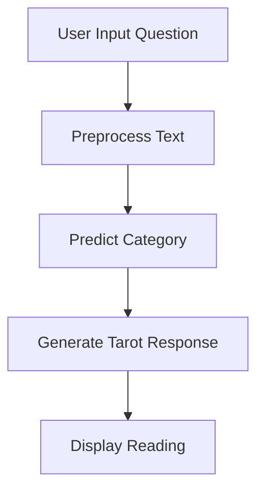
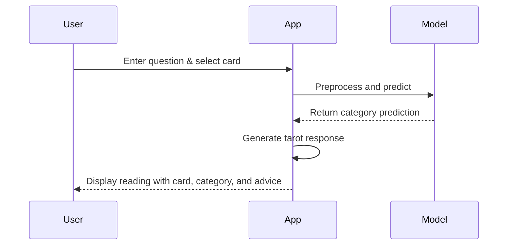
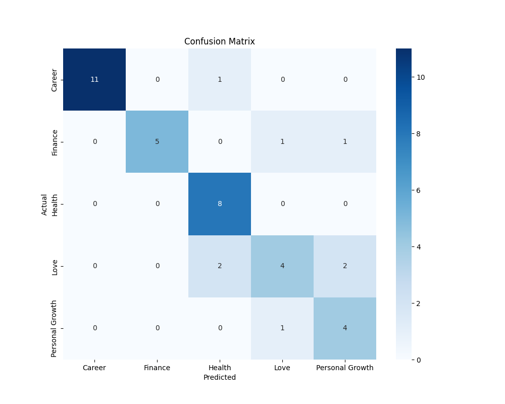

# Tarot Reading Prediction App

## Overview
This application uses machine learning to provide personalized tarot card readings based on user questions. The system classifies questions into categories (Love, Career, Finance, Health, Personal Growth) and generates meaningful tarot responses with relevant advice.

🔮 **Live Demo**: [Tarot Prediction App](https://tarot-prediction-v7dqgte4trjnogbjh3ad7e.streamlit.app/)

## Features
- Machine learning model trained on tarot reading data
- Five reading categories with tailored responses
- Option to select specific tarot cards or get a random card
- Confidence scores for predictions
- Beautiful Streamlit interface with custom styling

## System Architecture

### Flowchart


### Sequence Diagram


### Data Flow
1. User submits question
2. Text is preprocessed (lowercase, remove special chars, lemmatize)
3. Model predicts category (Love, Career, Finance, Health, Personal Growth)
4. System selects tarot card (user choice or random)
5. Response template is filled with relevant content
6. Reading is displayed with confidence score

## Model Performance
The SVM model with TF-IDF vectorization achieves good performance across categories:

```
              precision    recall  f1-score   support

      Career       0.85      0.92      0.88        48
     Finance       0.83      0.78      0.80        45
      Health       0.95      0.95      0.95        40
        Love       0.89      0.89      0.89        44
Personal Gro       0.89      0.83      0.86        47

    accuracy                           0.88       224
   macro avg       0.88      0.87      0.88       224
weighted avg       0.88      0.88      0.88       224
```



## Installation
1. Clone the repository
2. Install requirements:
```bash
pip install -r requirements.txt
```
3. Run the app:
```bash
streamlit run app.py
```

## Files Structure
```
tarot-app/
├── app.py                # Main Streamlit application
├── dataset_creation.py   # Script to generate synthetic dataset
├── model_creation.py     # Model training script
├── tarot_dataset.csv     # Generated dataset
├── tarot_model.pkl       # Trained model
├── requirements.txt      # Python dependencies
└── README.md             # This file
```

## How It Works
1. User enters a question about their life situation
2. Optionally selects a specific tarot card (or chooses "Random")
3. System:
   - Cleans and preprocesses the text
   - Predicts the most relevant category
   - Generates a personalized tarot reading
4. Displays the reading with:
   - Selected tarot card
   - Predicted category with confidence
   - Personalized advice and interpretation

## Future Enhancements
- Add more tarot cards and interpretations
- Improve model accuracy with more training data
- Add user accounts to save readings
- Include visual tarot card images
- Multi-language support

## Screenshot


*Note: For actual screenshot, you would need to add an image file to your repository*
